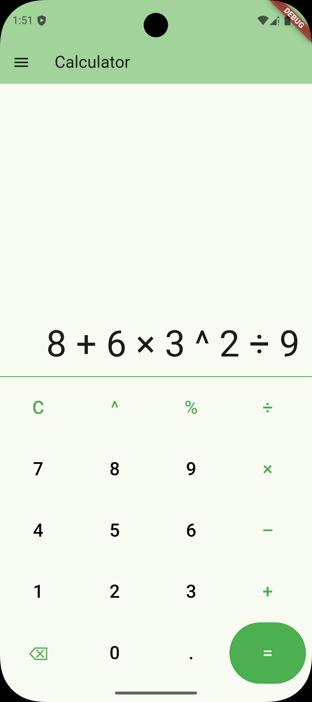
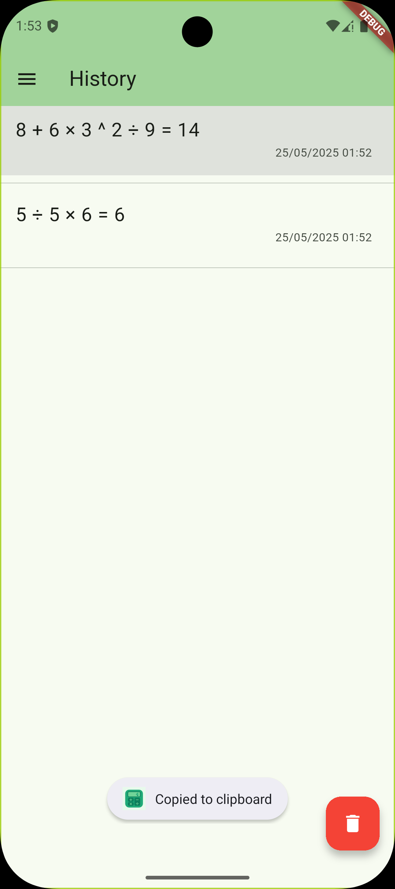
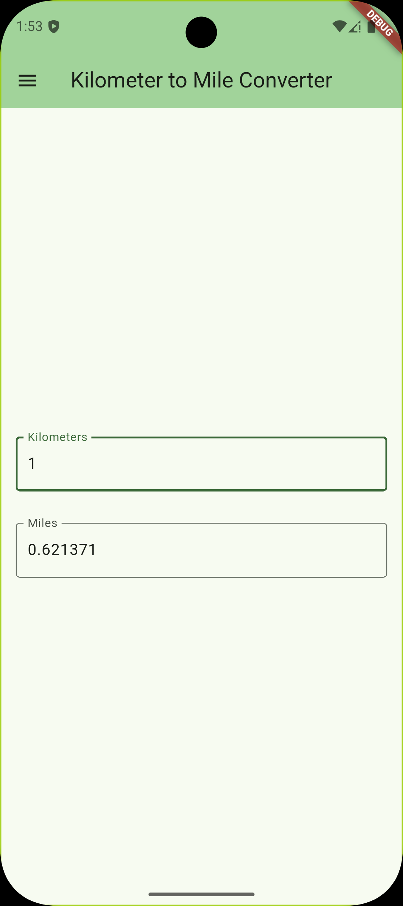
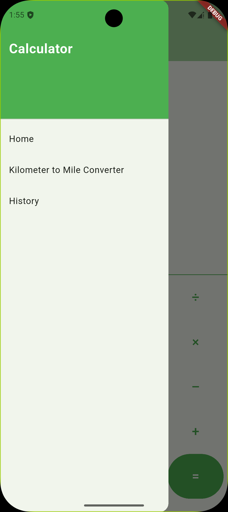

# Calculator

This is a simple calculator application developed for the assignments in SE-017 - Mobile
Applications at Estonian Entrepreneurship University of Applied Sciences during the 2024-2025 spring
semester.

This app allows users to perform basic arithmetic operations, convert kilometers to miles, and keep
a history of calculations.

## Used Technologies

This application is built using Flutter and Dart, leveraging Android Studio for development.

## Screenshots

   